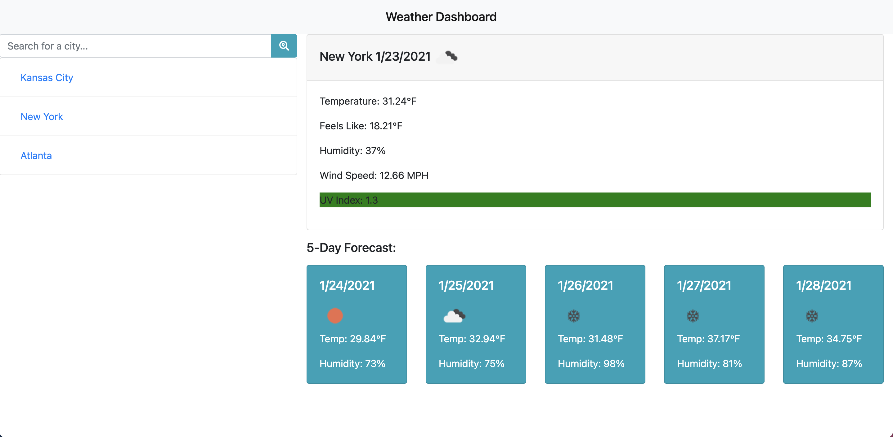

# Weather-Dashboard
A weather dashboard built using the Open Weather Map API, Bootstrap, and jQuery.

## Description
A simple, mobile-friendly weather app!

This application uses two different API calls, both endpoints of the Open Weather Map API:

1. Current weather by city name:
   1. https://api.openweathermap.org/data/2.5/weather?q={city name}&appid={API key}
1. And the One Call API endpoint (by latitude and longitude):
   1. https://api.openweathermap.org/data/2.5/onecall?lat={lat}&lon={lon}&exclude={part}&appid={API key}
    
On user search, these API calls allow the application to dynamically generate:

* The current weather conditions for the searched city, including:
  * Icons corresponding to the current conditions
  * Temperature
  * Feels like
  * Humidity
  * Wind speed, and
  * UV index
  
* A five-day forecast for the searched city including:
  * Dates
  * Icons corresponding to the daily weather conditions
  * Temperature, and
  * Humidity

* A search history, built using local storage, appended via link buttons to the basic HTML

The application is built using Bootstrap (v. 4.5): https://cdn.jsdelivr.net/npm/bootstrap@4.5.3/dist/css/bootstrap.min.css, 
and jQuery (v. 3.5): https://code.jquery.com/jquery-3.5.1.min.js.

This application is hosted by GitHub pages and is deployed at https://eliaswolfgang.github.io/Weather-Dashboard/.

## Screenshot
A screenshot of the deployed application:

